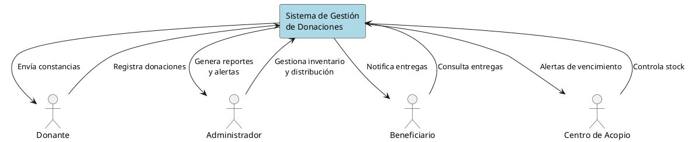
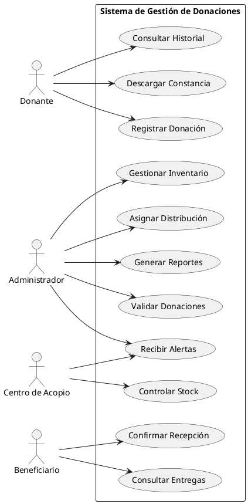
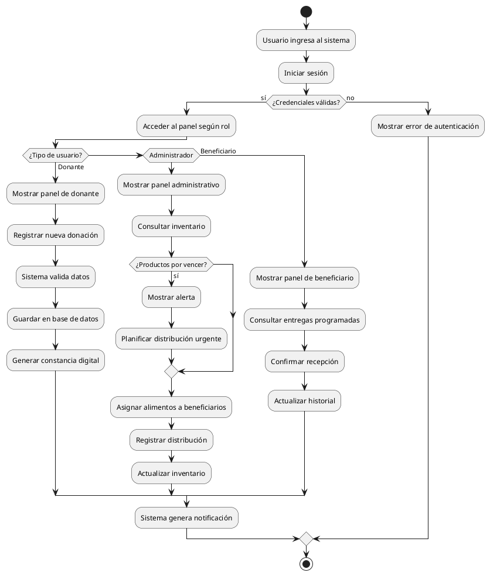
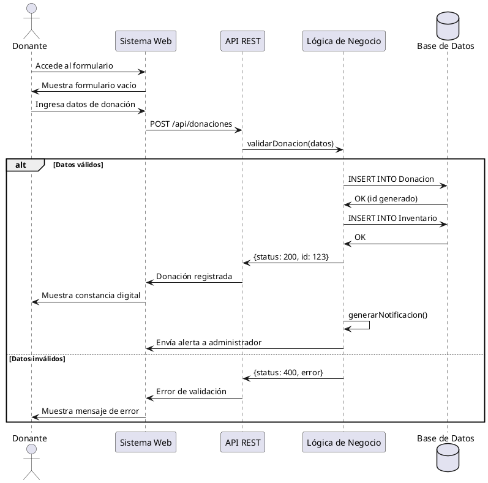
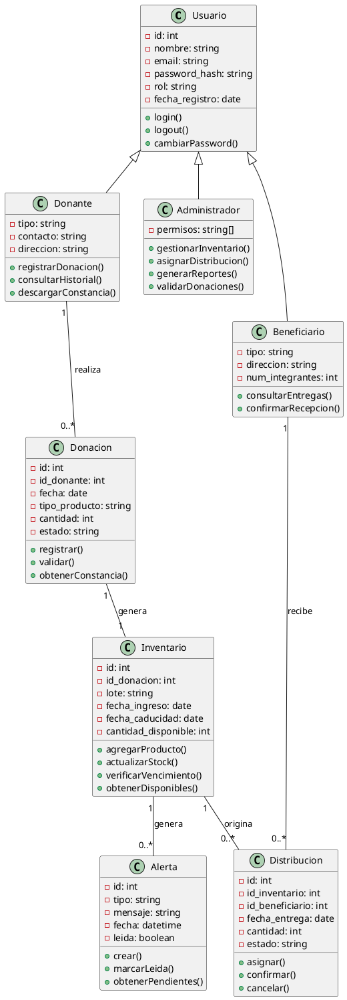
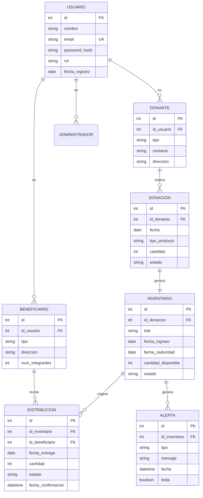
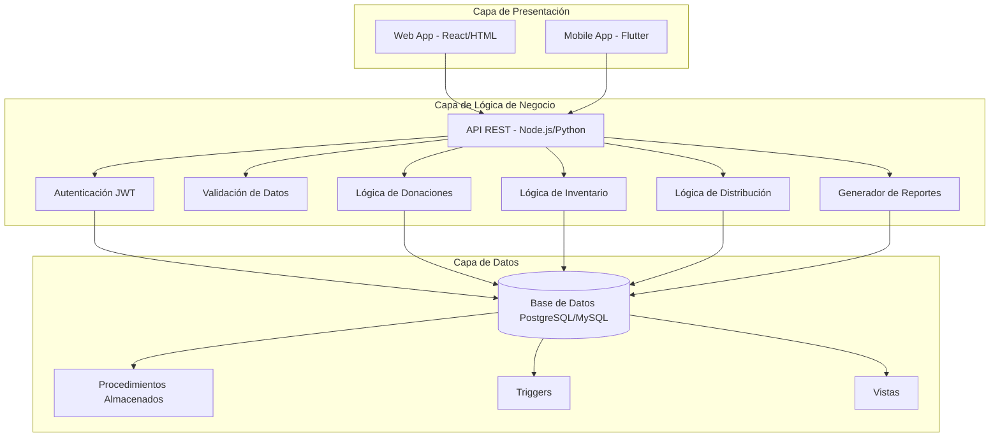
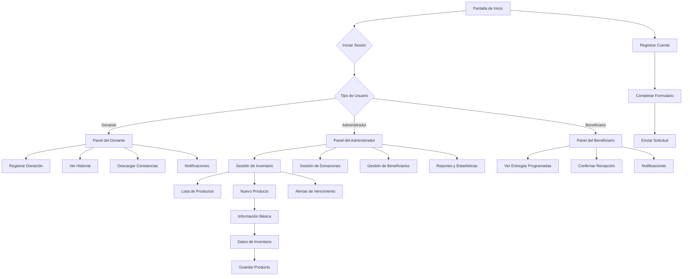
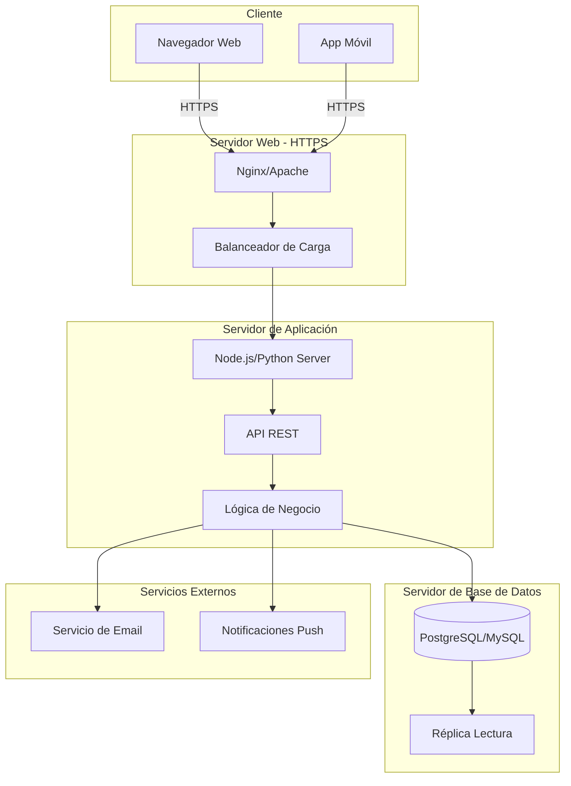
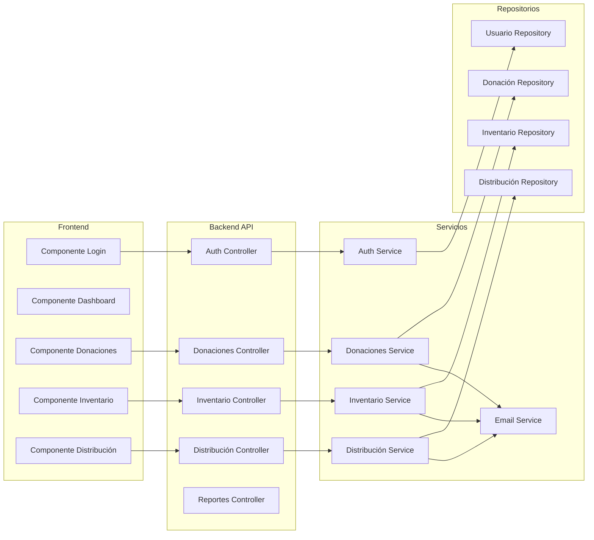

# Sistema de Gestión y Reducción del Desperdicio de Alimentos

## 1. Diagrama de Contexto (PlantUML)



## 2. Diagrama de Casos de Uso (PlantUML)



## 3. Diagrama de Actividad (PlantUML)



## 4. Diagrama de Secuencia - Registrar Donación (PlantUML)



## 5. Diagrama de Clases (PlantUML)



## 6. Modelo Entidad-Relación (Mermaid)



## 7. Diagrama de Arquitectura (Mermaid)



## 8. Flujo de Navegación (Mermaid)



## 9. Diagrama de Despliegue (Mermaid)



## 10. Diagrama de Componentes (Mermaid)



---

## Instrucciones para usar estos diagramas:

### PlantUML
1. Copia el código y guárdalo con extensión `.puml`
2. Usa [PlantUML Online](http://www.plantuml.com/plantuml/uml/) o instala la extensión en VS Code
3. Genera las imágenes en formato PNG o SVG

### Mermaid
1. Copia el código en archivos `.md` o `.mmd`
2. GitHub renderiza automáticamente los diagramas Mermaid
3. También puedes usar [Mermaid Live Editor](https://mermaid.live/)

### Estructura recomendada para GitHub:
```
proyecto/
├── docs/
│   ├── diagramas/
│   │   ├── README.md (este archivo)
│   │   ├── contexto.puml
│   │   ├── casos-uso.puml
│   │   ├── actividad.puml
│   │   ├── secuencia.puml
│   │   ├── clases.puml
│   │   ├── er-diagram.mmd
│   │   ├── arquitectura.mmd
│   │   ├── navegacion.mmd
│   │   ├── despliegue.mmd
│   │   └── componentes.mmd
│   └── images/
│       └── (imágenes generadas)
└── README.md
```
